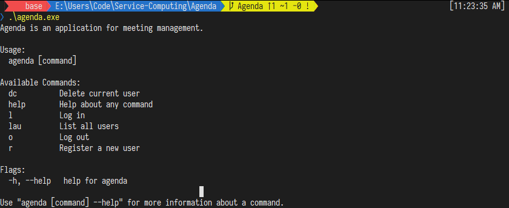
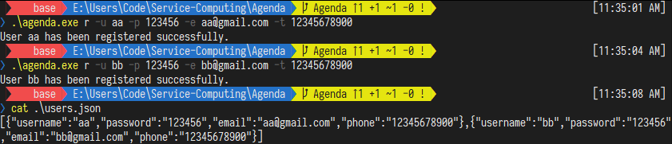
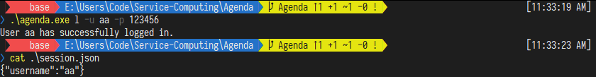
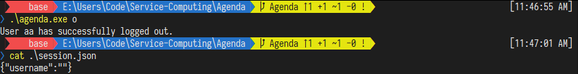
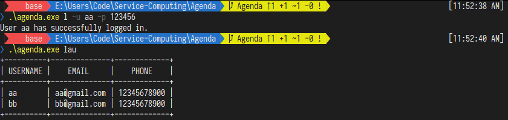
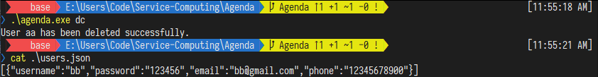

# Go Agenda

> 服务计算课程作业

GoOnline 项目地址：http://www.go-online.org.cn:8080/share/bmnqg0e76kvs669u23q0?secret=false

博客地址：

## 业务需求

+ 用户注册
  +  注册新用户时，用户需设置一个唯一的用户名和一个密码。另外，还需登记邮箱及电话信息。 
  +  如果注册时提供的用户名已由其他用户使用，应反馈一个适当的出错信息；成功注册后，亦应反馈一个成功注册的信息。 
+ 用户登录
  +  用户使用用户名和密码登录 Agenda 系统。 
  +  用户名和密码同时正确则登录成功并反馈一个成功登录的信息。否则，登录失败并反馈一个失败登录的信息。 
+ 用户登出
  +  已登录的用户登出系统后，只能使用用户注册和用户登录功能。 
+ 用户查询
  +  已登录的用户可以查看已注册的所有用户的用户名、邮箱及电话信息。 
+ 用户删除
  +  已登录的用户可以删除本用户账户（即销号）。 
  +  操作成功，需反馈一个成功注销的信息；否则，反馈一个失败注销的信息。 
  + 删除成功则退出系统登录状态。删除后，该用户账户不再存在。

## 目录结构

项目使用 Go Modules 进行构建，其目录结构如下。

```
├── cmd
│	├── root.go
│	├── session.go
│	└── user.go
├── entity
│	├── session.go
│	├── storage.go
│	└── user.go
├── service
│	├── init.go
│	├── session.go
│	└── user.go
├── go.mod
└── main.go
```

+ `cmd` 目录存访 CLI 命令实现代码。
+ `entity` 目录存放 `User` 对象读写与处理逻辑代码。
+ `service` 目录存放业务逻辑实现代码。

## 实现过程

### 创建项目

我们使用 Go Modules 构建项目，通过执行以下命令，我们即可创建名为 `github.com/Jiahonzheng/Go-Agenda` 的 Module 。

```bash
go mod init github.com/Jiahonzheng/Go-Agenda
```

### 数据持久化

在 Agenda 中，各个组成部分（用户、会议模块）都有**数据持久化**的需求，因此设计数据持久化工具是非常有必要的。在代码实现中，我们实现了 `Storage` 类完成此功能。

```go
// Storage persists data.
type Storage struct {
	Path string
}
```

`Storage` 对外提供了两种方法：用于从 JSON 文件读取数据的 `Load` 方法、用于写入数据至 JSON 文件的 `Save` 方法。

```go
// Load reads data from JSON file.
func (s *Storage) Load(v interface{}) error {
	f, err := os.Open(s.Path)
	if err != nil {
		return err
	}
	defer f.Close()
	// Read data from JSON file.
	return json.NewDecoder(f).Decode(v)
}

// Save writes data into JSON file.
func (s *Storage) Save(v interface{}) error {
	f, err := os.Create(s.Path)
	if err != nil {
		return err
	}
	defer f.Close()
	// Write data into JSON file.
	return json.NewEncoder(f).Encode(v)
}
```

### 登录状态管理

类似 Web 应用开发，我们需要管理登录状态的工具（技术）。我们的思路很简单：当用户登录成功时，写入有效的 `username` 至 `session.json` 文件；当用户登出时，写入无效的 `username` 至 `session.json` 文件；Agenda 在每次启动时，都会检查 `session.json` 文件中的 `username` 是否有效。上述登录状态管理功能由 `Session` 实现。

```go
// Session maintains Login Session.
type Session struct {
	Username string `json:"username"`
}

var sessionStorage = Storage{Path: "session.json"}

// GetSession return the current session.
func GetSession() *Session {
	session := new(Session)
	// If session.json exists, load it.
	if err := sessionStorage.Load(session); err != nil && !os.IsNotExist(err) {
		log.Fatalln("Unable to load session data.")
	}
	return session
}
```

通过执行 `GetSession` 方法，我们可获得 `Session` 对象，该对象存访着 `session.json` 的数据，对外提供了可判断是否用户已登录的 `GetCurrentUser` 方法，以及用户登录和用户登出的方法。

```go
// GetCurrentUser returns the current user logged in.
func (s *Session) GetCurrentUser() (string, bool) {
	if s.Username == "" {
		return "", false
	}
	return s.Username, true
}

// Login sets the session.
func (s *Session) Login(username string) error {
	s.Username = username
	return sessionStorage.Save(s)
}

// Logout resets the session.
func (s *Session) Logout() error {
	s.Username = ""
	return sessionStorage.Save(s)
}
```

根据 `Session` 提供的三个接口，我们在 `service` 实现了 `checkLogin` 、`Login` 和 `Logout` 功能函数。

```go
// checkLogin checks whether Agenda is logged in.
func checkLogin() (string, error) {
	username, ok := session.GetCurrentUser()
	if !ok {
		return "", ErrNeedLogIn
	}
	return username, nil
}

// Login via username and password.
func Login(username, password string) error {
	if _, err := checkLogin(); err == nil {
		return ErrHaveLoggedIn
	}
	if u, ok := users.FindByUsername(username); !ok || u.Password != password {
		return ErrWrongUsernameOrPassword
	}
	if err := session.Login(username); err != nil {
		return err
	}
	fmt.Printf("User %s has successfully logged in.", username)
	return nil
}

// Logout the current user.
func Logout() error {
	var username string
	username, err := checkLogin()
	if err != nil {
		return err
	}
	if err := session.Logout(); err != nil {
		return err
	}
	fmt.Printf("User %s has successfully logged out.", username)
	return nil
}
```

### 用户管理

在 Agenda 中，我们需要管理多个用户信息。在实现中，我们定义了 `User` 表示用户信息，定义了 `Users` 表示 `User` 管理者。

```go
// User struct.
type User struct {
	Username string `json:"username"`
	Password string `json:"password"`
	Email    string `json:"email"`
	Phone    string `json:"phone"`
}

// Users maintains the list of User.
type Users struct {
	Users []*User
}
```

我们可通过 `GetUsers` 方法从 `users.json` 文件中获取所有的用户信息。

```go
var usersStorage = Storage{Path: "users.json"}

// Return the current users.
func GetUsers() *Users {
	users := new(Users)
	if err := usersStorage.Load(&users.Users); err != nil && !os.IsNotExist(err) {
		log.Fatalln("Unable to load users data.")
	}
	return users
}
```

此外，在更新完用户信息后，我们需要将当前所有的用户信息写入到磁盘，实现**数据持久化**。

```go
// Save persists the current users data.
func (us *Users) Save() error {
	return usersStorage.Save(us.Users)
}
```

#### 创建用户

我们可通过 `Add` 方法完成用户的添加。

```go
// Add a new user.
func (us *Users) Add(u *User) bool {
	if _, ok := us.FindByUsername(u.Username); ok {
		return false
	}
	us.Users = append(us.Users, u)
	return true
}
```

在 `service/user.go` 中，我们基于 `Users.Add` 方法实现了**用户注册**的业务逻辑。

```go
// Register a user via username, password, email and phone.
func Register(username, password, email, phone string) error {
	if ok := users.Add(&entity.User{Username: username, Password: password, Email: email, Phone: phone}); !ok {
		return ErrConflictUsername
	}
	if err := users.Save(); err != nil {
		return err
	}
	fmt.Printf("User %s has been registered successfully.", username)
	return nil
}
```

#### 查询用户

由于用户登录、创建用户时都需要对单个用户进行查询，因此实现 `FindByUsername` 是有必要的。

```go
// FindByUsername checks whether an user exists.
func (us *Users) FindByUsername(username string) (*User, bool) {
	for _, u := range us.Users {
		if u.Username == username {
			return u, true
		}
	}
	return nil, false
}
```

当我们需要对全部用户进行查询时，可调用 `ListAllUsers` 方法。

```go
// ListAllUsers list all users.
func (us *Users) ListAllUsers() []*User {
	return us.Users
}
```

基于 `Users.ListAllUsers` 方法，我们封装了**查询所有用户**的业务逻辑。

```go
import "github.com/olekukonko/tablewriter"

// ListAllUsers list all users.
func ListAllUsers() error {
	if _, err := checkLogin(); err != nil {
		return err
	}
	// Use TableWriter to display all users.
	table := tablewriter.NewWriter(os.Stdout)
	// Set the column names of the table.
	table.SetHeader([]string{"Username", "Email", "Phone"})
	table.SetAlignment(tablewriter.ALIGN_LEFT)
	for _, u := range users.ListAllUsers() {
		table.Append([]string{u.Username, u.Email, u.Phone})
	}
	// Print the table.
	table.Render()
	return nil
}
```

注意到，我们使用了 `github.com/olekukonko/tablewriter` 包美化用户信息输出结果。

#### 删除用户

`Users` 对外提供了  `DeleteByUsername` 方法，用于根据用户名删除指定用户。

```go
// DeleteByUsername deletes an user.
func (us *Users) DeleteByUsername(username string) error {
	users := us.Users
	for i := 0; i < len(users); i++ {
		if users[i].Username == username {
			// Delete the user from the list.
			users[i], users[len(users)-1] = users[len(users)-1], users[i]
			us.Users = users[:len(users)-1]
			return nil
		}
	}
	return fmt.Errorf("user %s not found", username)
}
```

基于 `Users.DeleteByUsername` 方法，我们封装了**删除当前用户**的业务逻辑。

```go
// DeleteCurrentUser deletes current user logged in.
func DeleteCurrentUser() error {
	username, err := checkLogin()
	if err != nil {
		return err
	}
	err = users.DeleteByUsername(username)
	if err != nil {
		return err
	}
	// Persist data.
	err = users.Save()
	if err != nil {
		return err
	}
	// Logout the current user.
	if err := session.Logout(); err != nil {
		return err
	}
	fmt.Printf("User %s has been deleted successfully.", username)
	return nil
}
```

### Cobra

我们使用 开发命令行交互功能。首先，我们声明了 `rootCmd` ，作为 Cobra 命令行的主入口。

```go
var rootCmd = &cobra.Command{
	Use:   "agenda",
	Short: "Application for meeting management.",
	Long:  "Agenda is an application for meeting management.",
}
```

随后，我们基于 `service` 提供的 API 构建命令行接口。以登录接口为例，我们先创建 `loginCmd` 变量，并声明其相关参数。

```go
// Login Command
var (
	loginCmd = cobra.Command{
		Use:   "l",
		Short: "Log in",
		Long:  "Log in Agenda with username and password of a registered account.",
	}
	loginCmdUsernameP = loginCmd.Flags().StringP("username", "u", "", "username of a registered account")
	loginCmdPasswordP = loginCmd.Flags().StringP("password", "p", "", "password of a registered account")
)
```

随后，我们在 `login` 函数中使用 `loginCmdUsernameP` 和 `loginCmdPasswordP` 变量，调用 `service.Login` 方法。

```go
// login responds to Login Command.
func login(cmd *cobra.Command, args []string) error {
	if *loginCmdUsernameP == "" {
		return errors.New("username is required")
	}
	if *loginCmdPasswordP == "" {
		return errors.New("password is required")
	}
	err := service.Login(*loginCmdUsernameP, *loginCmdPasswordP)
	checkError(err)
	return nil
}
```

最后，我们将 `loginCmd` 和 `login` 绑定起来，并添加至 `rootCmd` 中，即可完成登录的命令行交互接口。

```go
func init() {
	loginCmd.RunE = login
	logoutCmd.RunE = logout
	// Add commands.
	rootCmd.AddCommand(&loginCmd, &logoutCmd)
}
```

## 命令列表

#### Login

```bash
.\agenda.exe l -h

Log in Agenda with username and password of a registered account.

Usage:
  agenda l [flags]

Flags:
  -h, --help              help for l
  -p, --password string   password of a registered account
  -u, --username string   username of a registered account
```

#### Logout

```BASH
.\agenda.exe o -h

Log out current account.

Usage:
  agenda o [flags]

Flags:
  -h, --help   help for o
```

#### Register

```bash
.\agenda.exe r -h

Register a new user with username, password, email and phone.

Usage:
  agenda r [flags]

Flags:
  -e, --email string      email of the user
  -h, --help              help for r
  -p, --password string   password of the user
  -t, --phone string      phone of the user
  -u, --username string   username of the user
```

#### List All Users

```bash
.\agenda.exe lau -h

List all users, logged in required.

Usage:
  agenda lau [flags]

Flags:
  -h, --help   help for lau
```

#### Delete Current User

```bash
.\agenda.exe dc -h

Delete current user, logged in required.

Usage:
  agenda dc [flags]

Flags:
  -h, --help   help for dc
```

## 程序演示

#### 帮助页面

```bash
.\agenda.exe
```



#### 用户注册

```bash
.\agenda.exe r -u aa -p 123456 -e aa@gmail.com -t 12345678900
```

执行上述命令后，我们即创建了用户名为 `aa` 的用户。我们再次创建一个用户，此时我们查看 `users.json` 的内容，内容符合预期。



#### 用户登录

```bash
.\agenda.exe l -u aa -p 123456
```

命令执行结果如下，`session.json` 内容符合预期。



#### 用户登出

```go
.\agenda.exe
```

命令执行结果如下，`session.json` 内容符合预期。



#### 查询用户

```bash
.\agenda.exe lau
```

命令执行结果如下。



#### 删除用户

```bash
.\agenda.exe dc
```

命令执行结果如下，`users.json` 内容符合预期。



