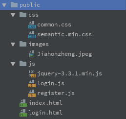
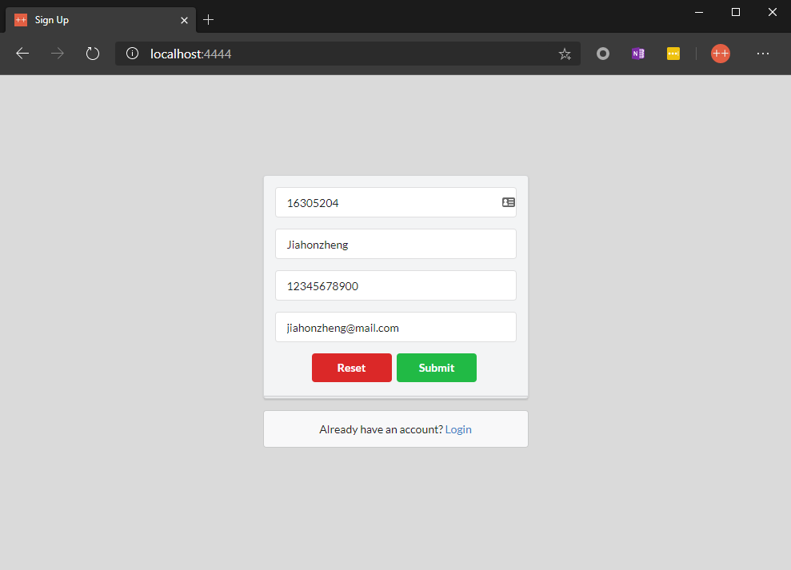
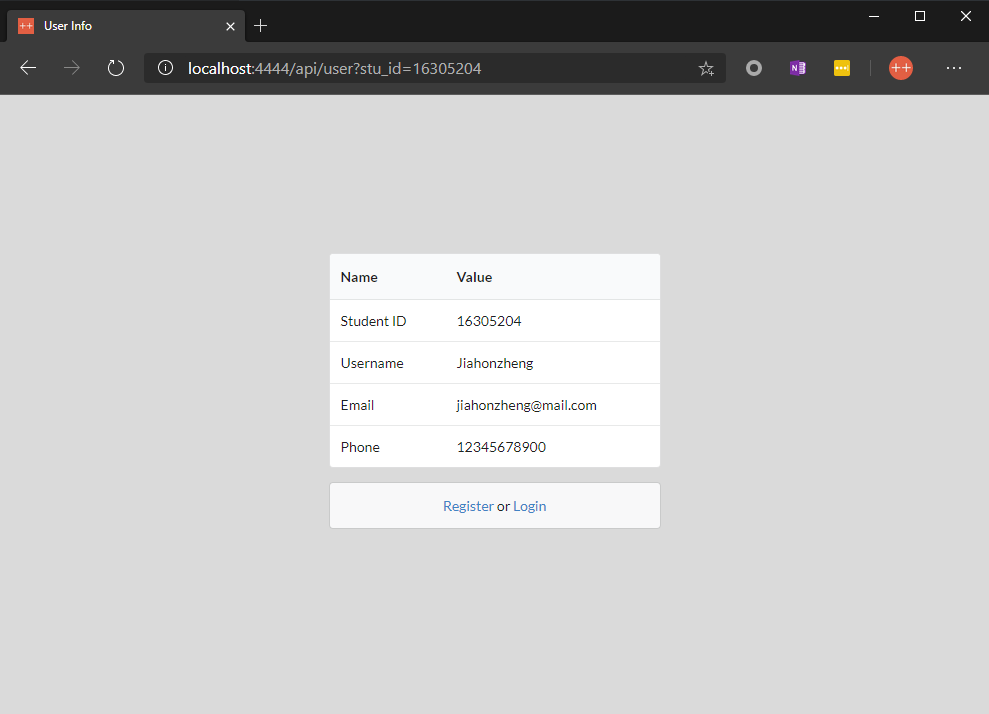
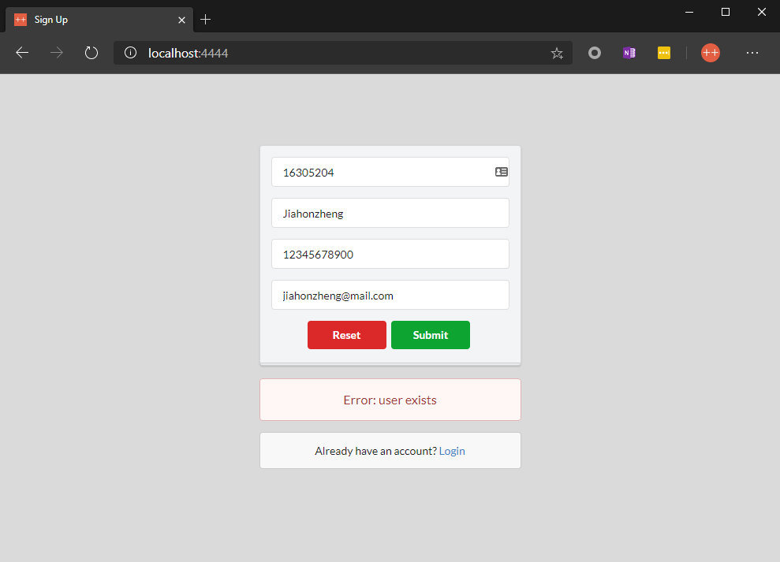
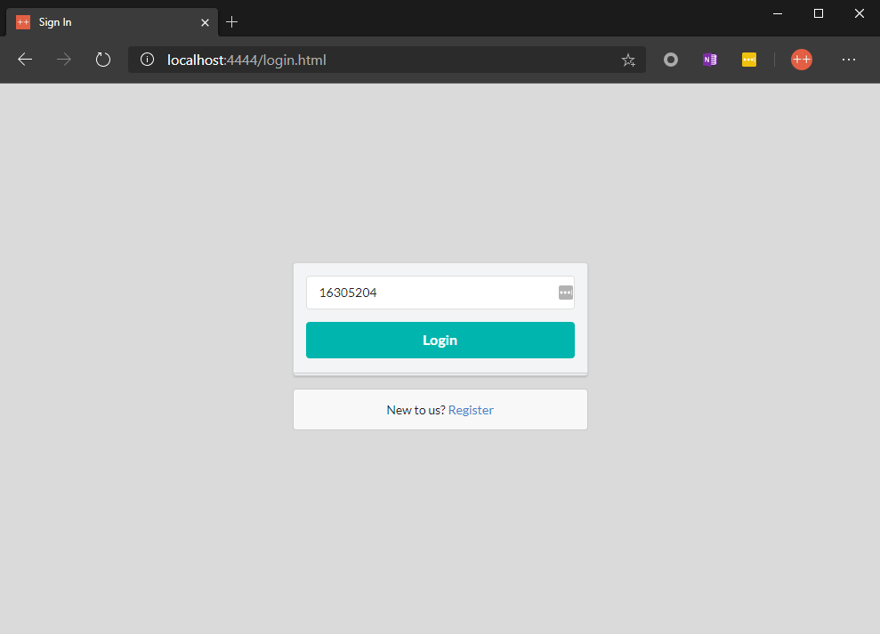
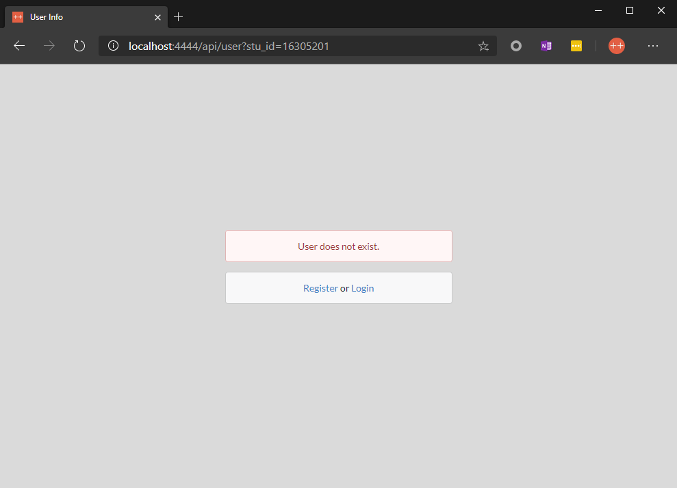
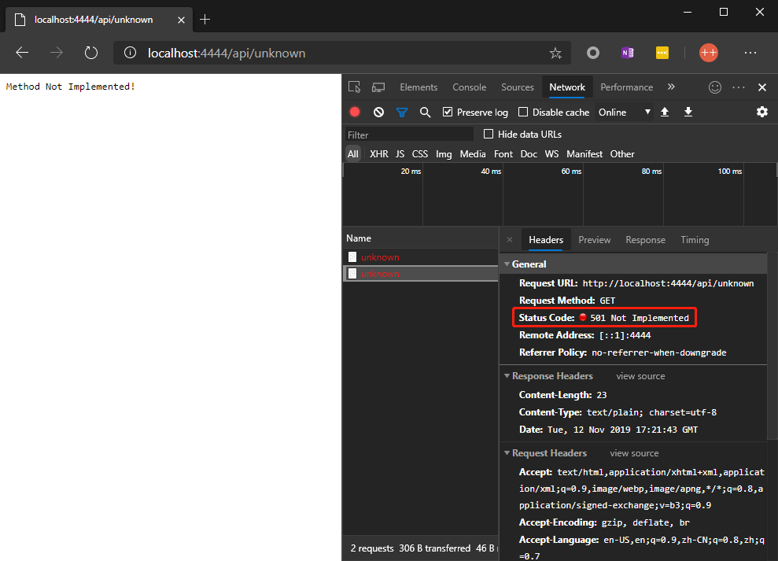

# CloudGo-IO

博客链接：

- [CloudGo-IO](https://blog.jiahonzheng.cn/2019/11/12/CloudGo-IO/)

- [Golang GZIP 源码分析](https://blog.jiahonzheng.cn/2019/11/12/Golang%20GZIP%20%E6%BA%90%E7%A0%81%E5%88%86%E6%9E%90/)

## 如何运行

```bash
# 编译项目
go build

# 运行项目
./CloudGo-IO.exe
```

## 项目目录

本项目使用 Go Modules 构建，其结构目录及其说明如下。

```
├── controller  // 业务逻辑控制器
├── db          // 数据存储层
├── dto         // 定义业务数据传递对象
├── errors      // 定义业务逻辑错误
├── model       // 数据操作层
├── public      // 静态文件目录
├── route       // 路由注册
├── service     // 业务逻辑
├── template    // 模板文件
├── go.mod
└── main.go     // 启动文件
```

## 具体实现

### 注册路由

在 `route` 包下，我们在各个文件的 `init` 函数注册了对应的路由。

```go
// route/home.go
func init() {
	http.Handle("/", http.FileServer(http.Dir("public")))
}

// route/unknown.go
func init() {
	http.HandleFunc("/api/unknown", func(w http.ResponseWriter, req *http.Request) {
		w.WriteHeader(http.StatusNotImplemented)
		_, _ = w.Write([]byte("Method Not Implemented!"))
	})
}

// route/user.go
var userController = new(controller.UserController)
func init() {
	http.HandleFunc("/api/user", userController.GetInfo)
	http.HandleFunc("/api/user/register", userController.SignUp)
}
```

在 `init` 函数注册完各 API 路由后，我们只需在 `main.go` 导入 `route` 包，即可实现路由的运行时绑定。

```go
package main

import "net/http"
import _ "github.com/Jiahonzheng/CloudGo-IO/route"

func main() {
	_ = http.ListenAndServe(":4444", nil)
}
```

### 文件服务

在 `route/home.go` 文件中，我们实现了**静态文件服务**，具体方式是通过 `http.FileServer` 实现的。

```go
http.Handle("/", http.FileServer(http.Dir("public")))
```

其中 `public` 文件目录存访着各种静态文件，如 HTML 、CSS 、JavaScript 文件，具体如下图所示。`index.html` 为**注册页面**，`login.html` 为**登录**页面。



### 参数解析

在 `/api/user/register` API 实现中，我们需要以下的**业务传递参数** DTO 。注意到，我们在 `UserSignUp` 结构体的各个字段都添加了 `tag` ，这是为了后续的**反序列化**工作的顺利进行。

```go
// dto/user.go
type UserSignUp struct {
	StuId    string `json:"stu_id"`
	Username string `json:"username"`
	Email    string `json:"email"`
	Phone    string `json:"phone"`
}
```

我们需要对来自前端的 POST 请求，进行反序列化处理，将请求数据与 `UserSignUp` 结构体进行绑定，这里我们使用了 `encoding/json` 对请求进行反序列化。

```go
 // controller/user.go
payload := &dto.UserSignUp{}
err := json.NewDecoder(req.Body).Decode(payload)
```

### 数据存储

尽管实验并未要求使用数据库，我在实现中还是实现了**数据存储层**。在该层实现中，我使用 `sync.Map` 作为存储的数据结构，保证了并发安全性。**当前存储层相当于内存型 KV 数据库**，断电（停止程序）后数据丢失。

```go
// db/simple_db.go
type SimpleDB struct {
	*sync.Map
}

var instance *SimpleDB

func init() {
	instance = new(SimpleDB)
	instance.Map = new(sync.Map)
}

func Get() *SimpleDB {
	return instance
}
```

### 模板渲染

在实现中，我们使用 `text/template` 包实现模板渲染，具体代码如下。

```GO
err, u := userService.GetUserInfo(q.Get("stu_id"))
if err != nil {
    u = &model.User{}
}
tmpl, _ := template.ParseFiles("template/user_info.tmpl")
_ = tmpl.Execute(w, u)
w.Header().Set("Content-Type", "text/html")
```

我们通过调用 `template.ParseFiles` 方法，声明一个模板渲染器，随后调用 `Excute` 方法根据 `User` 数据（存放用户信息）进行模板渲染，以下是模板 `user_info.tmpl` 的核心代码。我们使用了**条件渲染**对**用户存在**和**用户不存在**的不同场景，进行了不同的渲染逻辑。

```html
{{ if .StuId }}
<table class="ui table">
  <thead>
    <tr>
      <th>Name</th>
      <th>Value</th>
    </tr>
  </thead>
  <tbody>
    <tr>
      <td>Student ID</td>
      <td>{{.StuId}}</td>
    </tr>
    <tr>
      <td>Username</td>
      <td>{{.Username}}</td>
    </tr>
    <tr>
      <td>Email</td>
      <td>{{.Email}}</td>
    </tr>
    <tr>
      <td>Phone</td>
      <td>{{.Phone}}</td>
    </tr>
  </tbody>
</table>
{{ else }}
<div class="ui error message" id="errors">
  <div>User does not exist.</div>
</div>
{{ end }}
```

### 状态码

我们在 `errors/error.go` 文件中，定义了以下业务错误。

```go
var (
	ErrInvalidStuId     = New("invalid student id")
	ErrInvalidUsername  = New("invalid username")
	ErrInvalidEmail     = New("invalid email")
	ErrInvalidPhone     = New("invalid phone")
	ErrUserExists       = New("user exists")
	ErrUserDoesNotExist = New("user does not exist")
)
```

同时，为了实现业务错误到请求响应状态码的“无痛”转换，我们定义了 `ErrCode` 结构体，其定义了发生业务错误时的响应格式，注意到我们使用了 `json:"-"` 的 `tag` 禁止了 `HTTPStatusCode` 的序列化操作。

```go
type ErrCode struct {
	Code           int    `json:"code,omitempty"`
	Message        string `json:"msg,omitempty"`
	HTTPStatusCode int    `json:"-"`
}
```

我们在 `init` 函数，对各业务错误调用 `newErrorCode` 方法，进行业务错误与状态码的绑定。

```go
var codes = make(map[error]ErrCode)

func newErrCode(err error, status int, code int) {
	errCode := ErrCode{
		Code:           code,
		Message:        err.Error(),
		HTTPStatusCode: status,
	}
	codes[err] = errCode
}

func init() {
	newErrCode(ErrInvalidStuId, 401, 1)
	newErrCode(ErrInvalidUsername, 401, 2)
	newErrCode(ErrInvalidEmail, 401, 3)
	newErrCode(ErrInvalidPhone, 401, 4)
	newErrCode(ErrUserExists, 401, 5)
	newErrCode(ErrUserDoesNotExist, 401, 6)
}
```

经过了上述的绑定操作后，我们即可在业务逻辑函数，调用 `FromErrCode` 函数，从而实现业务逻辑错误到状态码的转换。

```GO
// errors/error.go
func FromErrCode(err error) (ErrCode, bool) {
	v, ok := codes[err]
	return v, ok
}

// controller/user.go
func handleError(w http.ResponseWriter, err error) {
	if errorCode, ok := errors.FromErrCode(err); ok {
		w.WriteHeader(errorCode.HTTPStatusCode)
		_ = json.NewEncoder(w).Encode(errorCode)
	} else {
		w.WriteHeader(http.StatusInternalServerError)
	}
}
```

## 界面演示

### 用户注册

编译并执行 `CloudGo-IO` 程序，在浏览器访问 `localhost:4444` ，即可观察到以下的**静态页面**（即**用户注册页面**），说明**静态文件服务**正常工作。



在填写如上图所示的表单内容后，我们点击 Submit 按钮，即可**提交表单**，实现注册用户操作。该操作成功后，页面会进入**用户信息页面**（URL 发生改变），在该页面上会**显示表单**，其内容如下。



当我们再次使用同样的 Student ID 进行用户注册操作时，其显示内容如下。



### 用户登录

我们可以点击上图页面底部的 Login 超链接，进入到**用户登录页面**，界面效果如下。



在点击 Login 按钮后，我们同样也可以进入到前面提及到的**用户信息页面**。当我们使用不存在的 Student ID 进行登录时，会显示以下内容。



### Unknown

当我们访问 `localhost:4444/api/unknown` 时，其会返回 501 错误，如下图所示。


